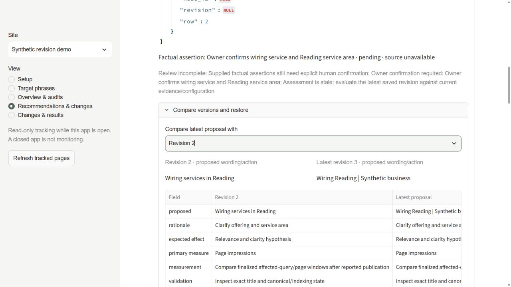
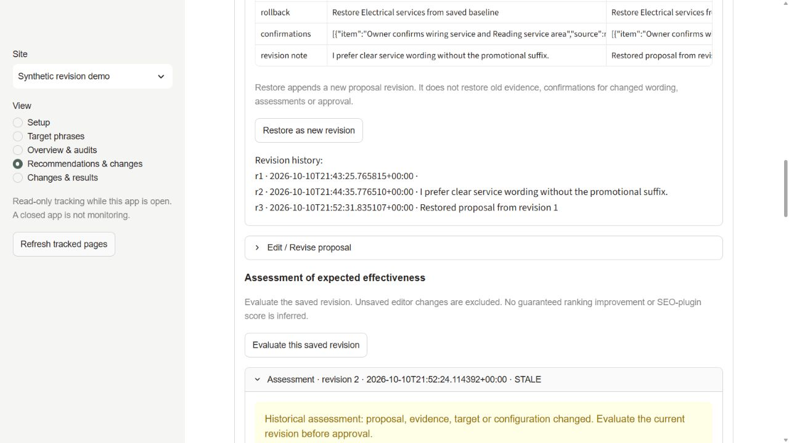

# Recommendation revisions and expected effectiveness

Open **Recommendations & changes → finding → Edit / Revise recommendation**.
Choose its exact field when starting a proposal. This creates or opens a stable
exact action in **Exact publication review**. Imported actions also have **Edit /
Revise proposal**. Reviewed reports remain immutable; revise their exact actions.

Edit the proposed value/action, rationale, expected effect, primary measure,
measurement, factual questions, validation and rollback. Optionally explain your
disagreement. **Save new proposal revision** appends history. It does not change
recommendation state, approve, reject, implement or publish. The original finding,
evidence and earlier revisions remain saved. A different target URL/field needs
its own exact action rather than carried approval.

**Compare versions and restore** compares each proposal field with any earlier
revision (revision 1 is original). **Restore as new revision** appends that proposal,
retaining the latest independently observed baseline. Changed wording resets facts
to pending unless the owner explicitly confirms the exact revised wording with a
source. Restore cannot restore old approvals or confirmations for changed wording.
Existing questions cannot be erased through the editor or another model opinion.
The owner can confirm a question's applicability with a source if no longer relevant.

The current website value/source is separate from editable proposals. **Adopt
independently observed public values** appends a revision from the latest successful
capture and matching exact field/structural target. Typed wording never becomes
verified evidence. A newly drafted finding has an unknown baseline until capture
adoption. Text/link targets require saved structural evidence; ambiguous placement
and unknown settings remain blocked. Refreshing public pages is read-only.

## Assessment of expected effectiveness

**Evaluate this saved revision** excludes unsaved edits. It pins the exact revision,
original, selected validated profile, goals, facts, effective rules, audit profile/
rules, own-audit file hashes, bounded target excerpts and public capture. Missing
data stays unknown. Mechanical checks assess unresolved owner facts, target/value
readiness, capture age, public destinations, index directives, exclusions, executable
markup and prohibited ranking promises. Literal phrase coverage is advisory and
cannot establish intent, readability, factual truth or ranking effectiveness.

There is currently **no configured model-review executor**. **Model review
unavailable** is explicit; mechanical checks are not a complete effectiveness
review. This feature enables no provider, credentials, outbound transmission,
scheduled jobs or spending.

Download the **private model review request** for an authorized local reviewer.
It includes exact binding/input hashes, bounded selected-site inputs, instructions
and JSON output schema. Do not send private evidence to an unapproved processor.
**Import model assessment** accepts only that current request, all five dimensions
and supplied evidence IDs. Reviewer/model identity is reported handoff provenance,
not independently authenticated. Extra approval or factual-confirmation fields
are rejected. Model text is displayed literally and never executed.

Model interpretation covers query intent, service/local relevance, clarity, factual
support and technical constraints. It presents improvements, weaknesses, evidence
IDs, advisory suggestions, uncertainty, missing owner questions and measurement.
The app checks reference identities, not whether model reasoning is correct.
Stylistic advice may be declined. A model cannot confirm owner facts, approve or
publish. Its missing owner questions persist across edits/second opinions and
remain enforced independently of advisory judgment.

Edits, relevant evidence/configuration changes or new captures make assessments
stale. Once assessment history exists, a current assessment is required before
freeze/approval. Mechanical-only assessment is allowed with its limitation visible;
it cannot clear unresolved mandatory factual or technical blockers.

Frozen historical packets and approvals retain their exact content. Revised wording
needs a new batch and human approval. New batches also pin configuration/evidence.
A fresh capture alone leaves unchanged actions' approval usable if their exact
frozen structural target/value still passes independent validation. Legacy packet
scope is preserved without historical rewrites.

## Limits and measurement

The evaluator establishes proposal identity, source/version association, mechanical
constraints and the rationale for model interpretation. Expected effectiveness is
an assessment, never a ranking guarantee or numerical uplift. Owner/clinician facts
require human confirmation. Real results require reported publication, inspection
of the exact rendered target and compatible equal complete finalized non-branded
query/page windows for impressions, landing-page alignment, position, CTR and clicks.
Demand, competition, other edits and small samples confound causality. Qualified
inquiries require owner data; Search Console does not establish them or Maps results.

Schema 4 adds append-only local `proposal_evaluations`. Protected backups and scoped
tracking exports retain all history. Restored assessments and approvals are historical
only; refresh evidence and create a fresh assessment/batch before reuse. Additive
migration uses the existing coordination gate. Search Console stays read-only.

## Synthetic demonstration

```powershell
.venv-mvp/Scripts/python.exe -m tests.proposal_demo --workspace .tmp/proposal-demo
$env:SEO_DEMO = "1"
$env:SEO_WORKSPACE = (Resolve-Path .tmp/proposal-demo).Path
.venv-mvp/Scripts/python.exe -m streamlit run app.py --server.address 127.0.0.1 --server.port 8513
```

Open **Synthetic revision demo → Recommendations & changes**, open the finding and
choose **Edit / Revise recommendation**. Change its proposed value to `Wiring services
in Reading`, add a disagreement reason and save. Compare revision 2 with original,
evaluate revision 2 and inspect unavailable-model notice, evidence and mandatory
facts. Restore original as revision 3; revision 2's assessment is stale and no
approval exists. The fixture connects no accounts, enables no jobs and writes no website.

The synthetic browser demonstration saved an alternative as revision 2, evaluated
that exact saved version, then restored the original as revision 3. The independent
current value and original recommendation remained intact; revision 2's assessment
became stale and owner facts remained pending. These screenshots contain only the
synthetic fixture:





Validation on October 10, 2026: all **200 tests** passed with
`python -m unittest discover -s tests -q`, including Streamlit AppTest. New tests
cover proposal/observation separation, original finding state, append-only history,
restore, unsaved edit exclusion, stale revisions/approvals/configuration/evidence/
audit completeness, enforced owner questions, advisory disagreement, unavailable
review infrastructure, strict model-output imports, delayed-import revalidation,
technical constraints, cross-site isolation and protected backup/restore history.
Model-review outputs were synthetic fixtures; no live model provider was activated
or benchmarked. The browser walkthrough made no website writes or approvals.
